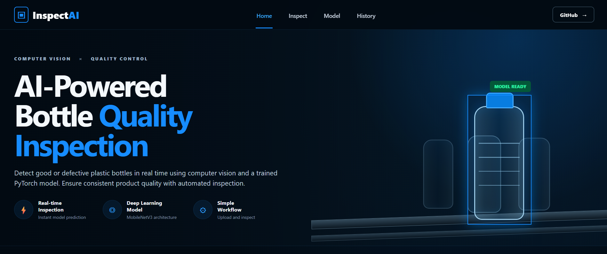
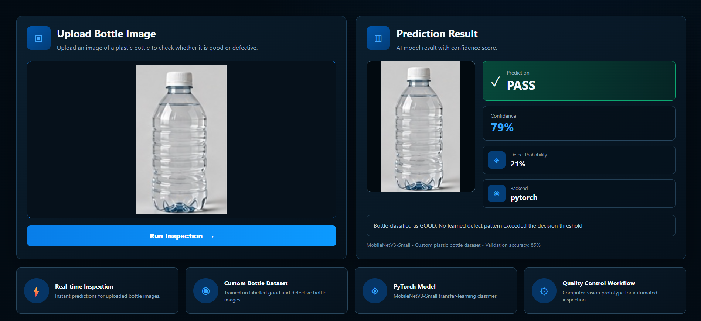
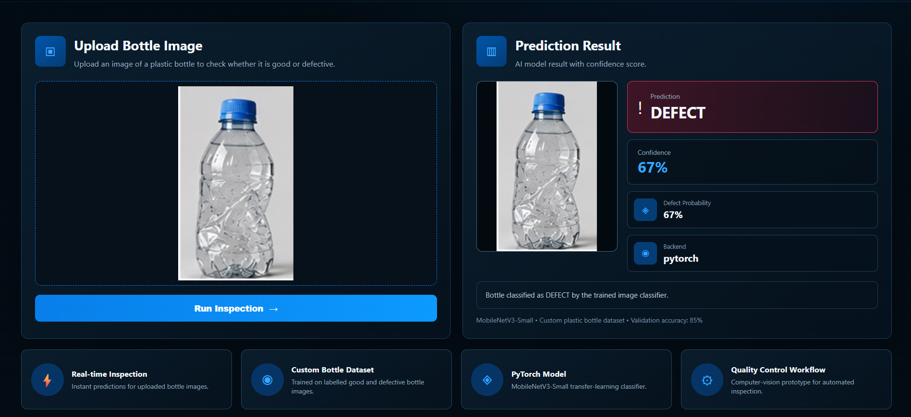

# InspectAI — AI-Powered Bottle Quality Inspection

InspectAI is a computer-vision quality inspection system that classifies plastic bottle images as **GOOD** or **DEFECT** using a trained **PyTorch MobileNetV3-Small** model.

It combines model inference, confidence scoring, defect probability, inspection history, and a browser-based industrial dashboard.

---

## Screenshots

### Dashboard



### Good Bottle Prediction



### Defective Bottle Prediction



---

## What It Does

The system accepts a plastic bottle image and predicts:

- **GOOD / PASS**
- **DEFECT**

It also displays:

- confidence score
- defect probability
- PyTorch backend
- validation accuracy
- recent inspection history

---

## Model + Dataset

- **Framework:** PyTorch
- **Architecture:** MobileNetV3-Small
- **Approach:** Transfer Learning
- **Task:** Binary Image Classification
- **Classes:** GOOD / DEFECT
- **Input Size:** 224 × 224 RGB image
- **Decision Threshold:** 50%

The dataset is organized as:

```text
dataset/
├── train/
│   ├── good/
│   └── defect/
└── val/
    ├── good/
    └── defect/